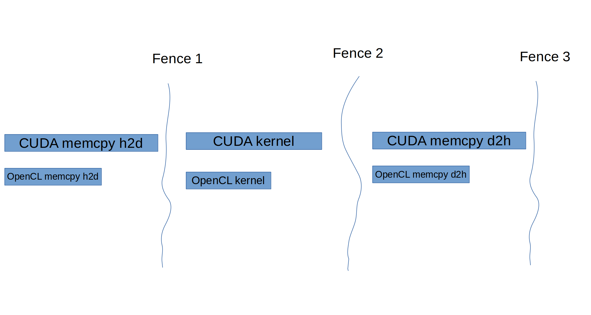

# Heterogeneous Nvidia (CUDA) and Intel (OpenCL) GPU Programming

An experiment of using multiple GPUs from different vendors with different programming launguages, taking vector addition as an example. 

The results show that the hybrid GPU scheme that uses NV dedicated GPU and Intel integrated GPU together is the fastest compared with the cases that uses CPU and one single GPU.

# Total Time Improve
Number of bytes in Giga: 1.44

## CPU
- Result on 11th Gen Intel(R) Core(TM) i9-11980HK @ 2.60GHz : 3.35544e+07
- cpu_routine took 450 milliseconds

## Intel Integrated GPU
- opencl_routine_memcpy_h2d_time took 58895 microseconds
- opencl_routine_kernel_time took 37442 microseconds
- opencl_routine_memcpy_d2h_time took 27718 microseconds
- Result on Intel(R) OpenCL HD Graphics  : 3.35544e+07
- opencl_routine took 530 milliseconds

## Nvidia GPU
- cuda_routine_preprocess_time took 828 microseconds
- cuda_routine_memcpy_h2d_time took 80367 microseconds
- cuda_routine_kernel_time took 4966 microseconds
- cuda_routine_memcpy_d2h_time took 36614 microseconds
- cuda_routine_postprocess_time took 5992 microseconds
- Result on NVIDIA CUDA : 3.35544e+07
- cuda_routine took 371 milliseconds

## Hybrid GPU (Fastest!)
### Methodology (Synchronization Diagram)

### Log
- heterogeneous_overlap_routine_preprocess_time took 54104 microseconds
- heterogeneous_overlap_routine_memcpy_h2d_time took 55325 microseconds
- heterogeneous_overlap_routine_kernel_time took 3067 microseconds
- heterogeneous_overlap_routine_memcpy_d2h_time took 26689 microseconds
- Result on Intel(R) OpenCL HD Graphics + NVIDIA CUDA : 3.35544e+07
- heterogeneous_overlap_routine took 327 milliseconds
